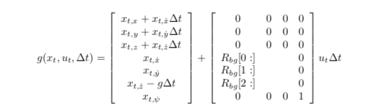
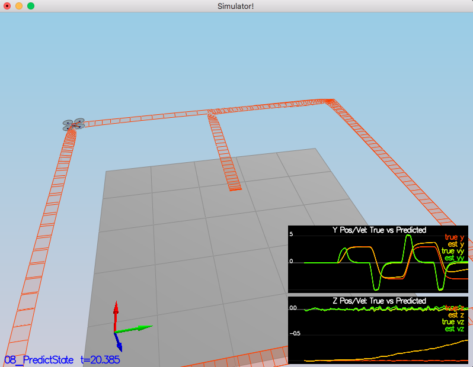
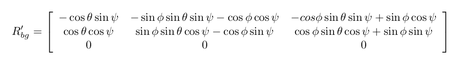
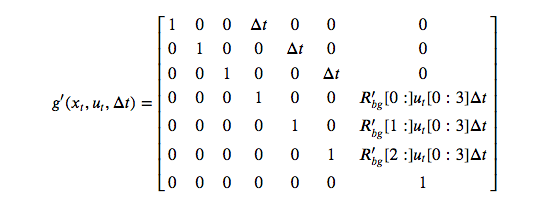
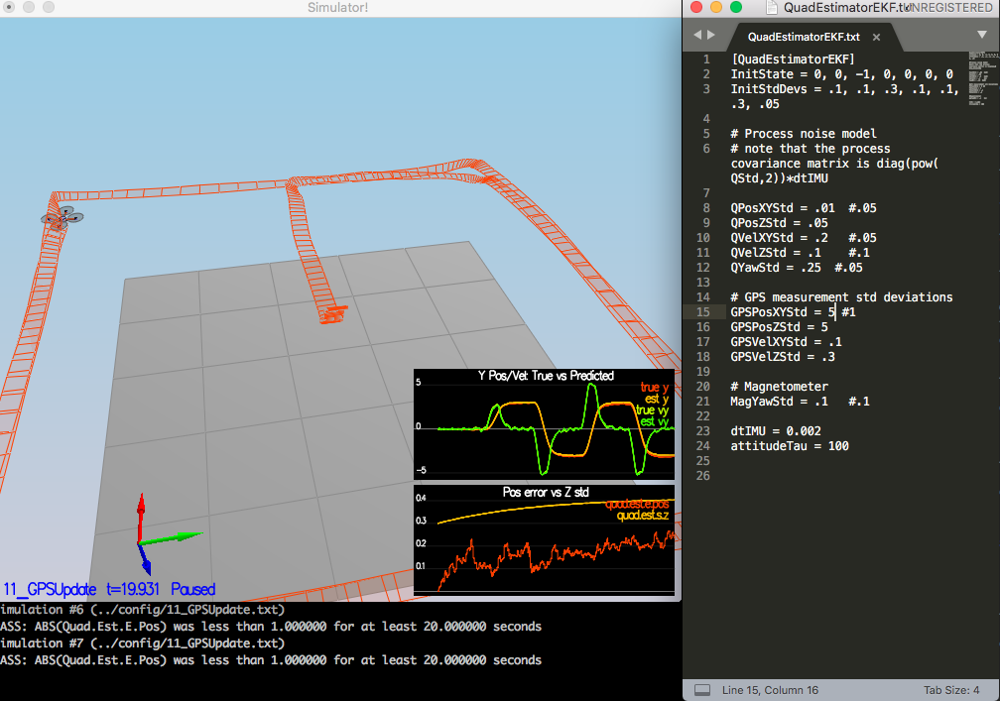
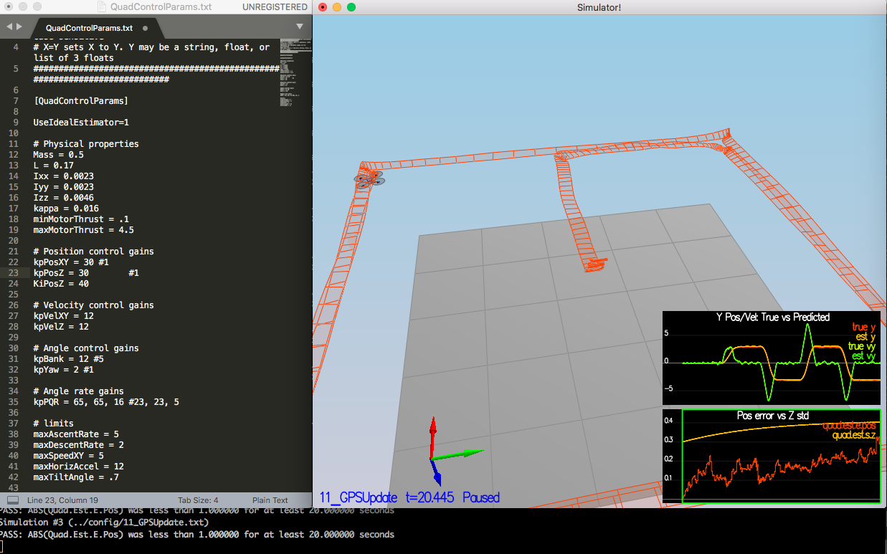

# Estimation Project #

## Step1: Sensor Noise ##

The standard deviation values calculated and used were:

	MeasuredStdDev_GPSPosXY = .71
	MeasuredStdDev_AccelXY = .511

## Step 2: Attitude Estimation ##

Following change was done for non-linear AttitudeEstimation

	Quaternion<float> dq = Quaternion<float>::FromEuler123_RPY(rollEst, pitchEst, ekfState(6));
	dq.IntegrateBodyRate(gyro, dtIMU);
		
	float predictedPitch = dq.Pitch();
	float predictedRoll = dq.Roll();
	ekfState(6) = dq.Yaw();

## Step 3: Prediction Step ##

### implement the state prediction step ###

Took some help from few gihub repository as was not able to map the requirement. Same helped me understand what part of excercises in lecture applies here and what equations to implement. Following equation gives tranition in 3d case and needed to implement in predict. Also in c++ it was easier to implement individual tranformation rather matrix multiplication

Code which achieved above was:

	predictedState(0) = curState(0) + dt * curState(3);
	predictedState(1) = curState(1) + dt * curState(4);
	predictedState(2) = curState(2) + dt * curState(5);
		
	V3F accel_inertial = attitude.Rotate_BtoI(accel);
		
	predictedState(3) = curState(3) + dt * accel_inertial.x;
	predictedState(4) = curState(4) + dt * accel_inertial.y;
	predictedState(5) = curState(5) + dt * accel_inertial.z - dt * CONST_GRAVITY;

With this in place scenario looks as follows:

### calculate the partial derivative of the body-to-global rotation matrix ###

Following matrix was to be implemented:

Here is the code:

		
	float theta = pitch;
	float phi = roll;
	float psi = yaw;
		
	float sinTheta = sin(theta);
	float cosTheta = cos(theta);
		
	float sinPhi = sin(phi);
	float cosPhi = cos(phi);
			
	float sinPsi = sin(psi);
	float cosPsi = cos(psi);
		
	RbgPrime(0, 0) = -cosTheta * sinPsi;
	RbgPrime(0, 1) = -sinPhi * sinTheta * sinPsi - cosPhi * cosPsi;
	RbgPrime(0, 2) = -cosPhi * sinTheta * sinPsi + sinPhi * cosPsi;
		
	RbgPrime(1, 0) = cosTheta * cosPsi;
	RbgPrime(1, 1) = sinPhi * sinTheta * cosPsi - cosPhi * sinPsi;
	RbgPrime(1, 2) = cosPhi * sinTheta * cosPsi - sinPhi * sinPsi;
		

### predict the state covariance forward ###

Equation to implement:

Code:

		gPrime(0,3) = dt;
		gPrime(1,4) = dt;
		gPrime(2,5) = dt;
		
		V3F accel_dt = accel * dt;
		
		gPrime(3, 6) = RbgPrime(0,0) * accel_dt.x + RbgPrime(0,1) * accel_dt.y + RbgPrime(0,2)*accel_dt.z;
		gPrime(4, 6) = RbgPrime(1,0) * accel_dt.x + RbgPrime(1,1) * accel_dt.y + RbgPrime(1,2)*accel_dt.z;
		gPrime(5, 6) = RbgPrime(2,0) * accel_dt.x + RbgPrime(2,1) * accel_dt.y + RbgPrime(2,2)*accel_dt.z;
		
		ekfCov = gPrime * ekfCov * gPrime.transpose() + Q;

-transposeInPlace(), as suggested in hints was giving error and hence transpose() was used.

### Adjust params ###

Here are the values:

	QPosXYStd = .01  #.05
	QVelXYStd = .20	 #.05

Here is how the graphs look:

!(./v_images/error_mag.png)

## Step 4: Magnetometer Update ##

Code:

	hPrime(0,6) = 1;
	zFromX(0) = ekfState(6); 
		
	// Checking the diff for adjustment
	if (magYaw - ekfState(6) > F_PI) zFromX(0) += 2.f*F_PI;
	if (magYaw - ekfState(6) < -F_PI) zFromX(0) -= 2.f*F_PI;

And tuned params:

	QYawStd = .25  #.05

And output:

	Simulation #2 (../config/10_MagUpdate.txt)
	PASS: ABS(Quad.Est.E.Yaw) was less than 0.120000 for at least 10.000000 seconds
	PASS: ABS(Quad.Est.E.Yaw-0.000000) was less than Quad.Est.S.Yaw for 80% of the time

## Step 5: Closed Loop + GPS Update ##

Code:

	hPrime(0,0) = 1;
	hPrime(1,1) = 1;
	hPrime(2,2) = 1;
	hPrime(3,3) = 1;
	hPrime(4,4) = 1;
	hPrime(5,5) = 1;
		
	zFromX = ekfState.head(6);

Image with drone traj after update function and params values:

## Step 6: Adding Your Controller ##

After replacing the controller code and params from previous assignment, quad worked without any issues. No retuning was required!! 

